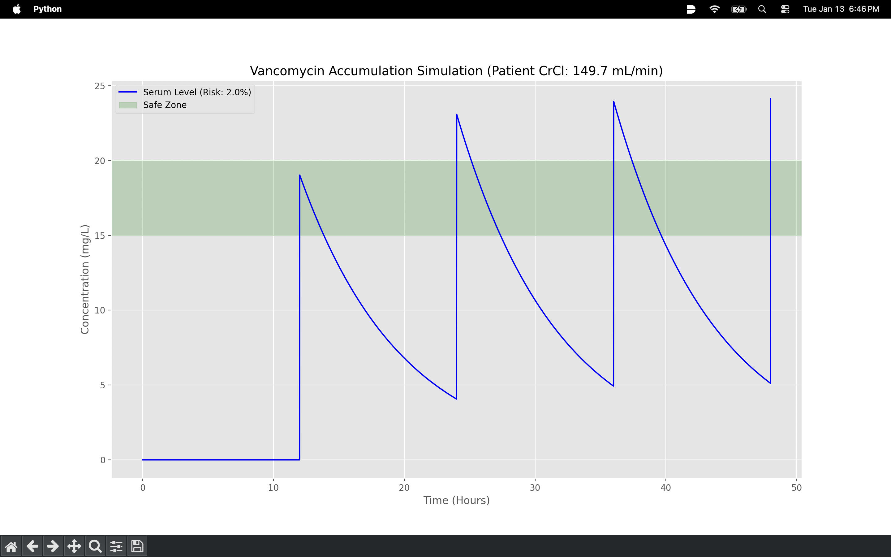

# 💊 Vanguard-AI: Clinical PK/PD Simulation & Risk Engine

[](https://www.python.org/downloads/)
[](https://scikit-learn.org/)

### **Bridging the gap between First-Principles Physics and Machine Learning to prevent Acute Kidney Injury (AKI).**

---

## 🏥 The Clinical Problem: The Vancomycin Paradox
Vancomycin is a life-saving antibiotic, but it possesses a **Narrow Therapeutic Index**. 

* **The Stakes:** Over-dosing leads to permanent **Acute Kidney Injury (AKI)**.
* **The Complexity:** Standard linear dosing fails to account for fluctuating **Renal Clearance ($CrCl$)** in elderly or high-risk populations.

---

## 🚀 Technical Pillars

### 1. **Numerical ODE Solver (The Physics Engine)**
Instead of using static peak/trough formulas, this engine implements a **Numerical Integrator** to solve the differential equation:
$$dC/dt = -k_e \cdot C$$
* **Multi-Dose Simulation:** Models drug "stacking" effects over 48-hour cycles.
* **Time-Stepped Integration:** Accounts for dose administration intervals to capture real-time accumulation.

### 2. **ML Safety Guard (The Intelligence)**
A **Random Forest Classifier** trained on 2,000 synthetic patient profiles.
* **Predictive Analytics:** Analyzes the non-linear relationship between age, weight, and serum creatinine.
* **Risk Stratification:** Predicts AKI probability before the first dose is administered.

### 3. **Physiological Modeling**
* **Creatinine Clearance:** Implements the **Cockcroft-Gault** equation to estimate renal function.
* **Pharmacokinetic Derivation:** Dynamically calculates the elimination constant ($k_e$) and Volume of Distribution ($V_d$) based on patient-specific physiology.

---

## 📊 Comparative Analysis

| **High-Risk Scenario (Elderly/Renal Impairment)** | **Low-Risk Scenario (Healthy Adult)** |
| :--- | :--- |
|  |  |
| **Status:** Flagged RED (Toxic Accumulation) | **Status:** Flagged BLUE (Therapeutic) |
| **Risk Score:** 100% | **Risk Score:** ~2% |

---
### Environment Setup
Clone the repository and enter the directory:
```bash
git clone [https://github.com/sameeralbostamy/PrecisionDose-AI.git](https://github.com/sameeralbostamy/PrecisionDose-AI.git)
cd PrecisionDose-AI

pip install -r requirements.txt

python3 main.py

## 🛠️ Project Architecture
```text
PrecisionDose-AI/
├── main.py              # Entry point & simulation orchestrator
├── core/                # Physics & Physiology Module
│   ├── __init__.py
│   ├── physiology.py    # Renal function & PK parameters
│   └── solver.py        # Numerical ODE solver
├── ml/                  # Machine Learning Module
│   ├── __init__.py
│   └── guard.py         # RandomForest AKI Risk Classifier
└── assets/              # Simulation visualizations
